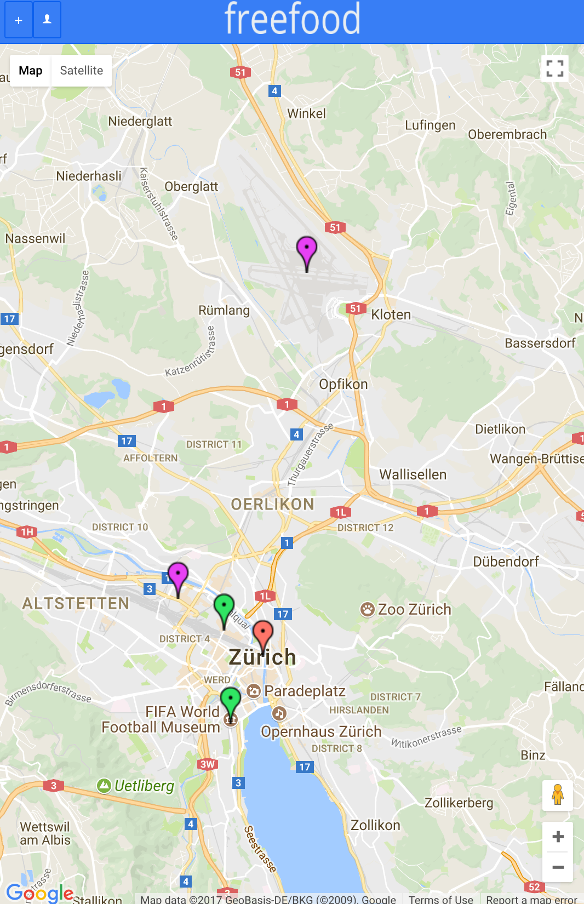
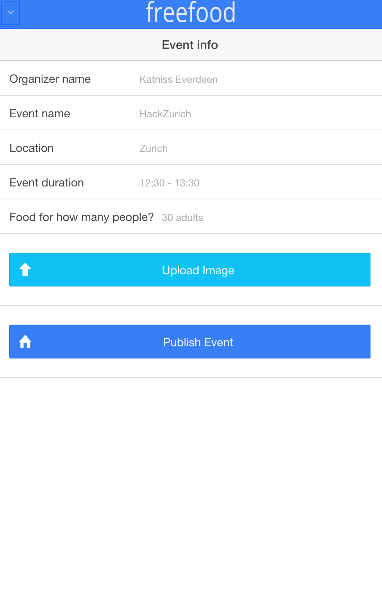
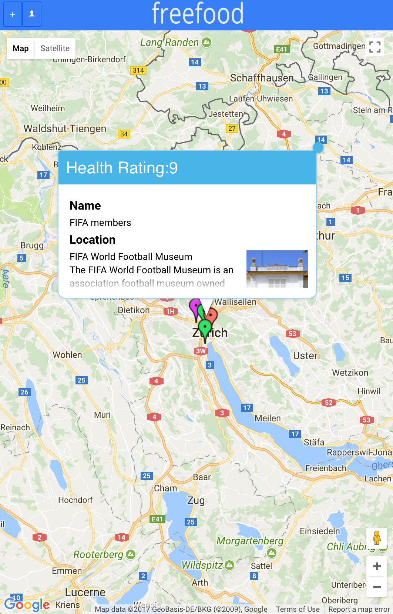

# FreeFood
An ionic application built to track the free food events for everyone :D 

## Dependencies 
* ionic 
* Xcode/Android (optional)
* Google maps  
 
## How to run the project
```
$ cd $REPO_PATH$
$ ionic serve
```

## Screenshots 




It should be very easy to extend and let us know if you have any suggestions! Have fun and enjoy your free food.
